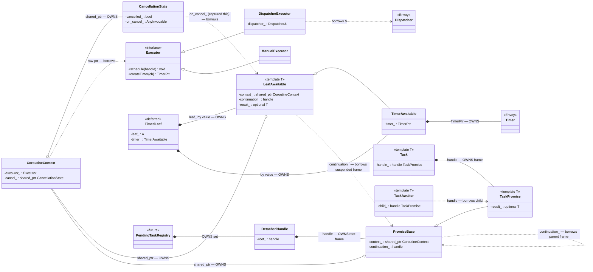

**tl;dr;** An implementation plan for the core Envoy coroutine primitives:
`Executor`, `CoroutineContext` (executor + cancellation), `Task<T>`, and the
callback-driven `LeafAwaitable`. Structured concurrency (`any_of`/`all_of`) and
cross-thread hopping are explicitly **out of scope for now**, but every core type
is shaped so they can be layered on without a rewrite. See [20260716_CORO_LIB.md]
for the requirements this plan implements.

# Scope

In scope (this plan):
- `Executor` interface + `DispatcherExecutor` (wraps `Event::Dispatcher`) + a
  `ManualExecutor` for tests.
- `CoroutineContext`: carries the executor and a `CancellationState`, propagated
  down the `co_await` chain through the promise.
- `Task<T>` / `Task<void>`: lazy, move-only, no-exceptions, symmetric-transfer
  continuation, context propagation.
- `LeafAwaitable<T>`: base class for bridging callback/OS events into a
  **cancellable** awaitable, plus `TimerAwaitable` (`sleep`) as the concrete
  example leaf.
- Root launch: `launch()` + `DetachedHandle` for starting a coroutine from
  non-coroutine code and getting a completion callback, with `cancel()`.

Deferred (must remain addable — see [Extension seams](#extension-seams)):
- Timeout, in all forms. Neither per-leaf default timeout nor `with_timeout()`
  ships in core, because timeout is a policy applied *over* an awaitable, not a
  property of a leaf (see [Timeout](#timeout-is-a-leaf-not-a-base-class-feature)).
  Core liveness rests on **cancellation** instead — the wrapper filter cancels on
  teardown and stream ops fail fast on reset — which is the mechanism that
  actually unwinds a stalled coroutine. The default-timeout net (a
  `TimerAwaitable`-based leaf race in `await_transform`) and `with_timeout()` over
  a sub-tree (`any_of(task, timer)`) land with the structured-concurrency work.
- Structured concurrency: `any_of`, `all_of`.
- Cross-thread hops and foreign executors.
- `PendingTaskRegistry` adopt-on-destroy (core provides the `DetachedHandle` it
  will hold; the registry container itself is layered on top).

# Design invariants (carried from the design docs)

- Parent outlives child across `co_await`; the only relaxation is the detached
  root, whose frame is owned by the `DetachedHandle` (later, the registry).
- No exceptions on the data plane: `unhandled_exception()` terminates. Errors
  travel as values (`absl::Status`/`StatusOr`) that the body checks and
  `co_return`s. Cancellation manifests as a leaf resuming with an abort status,
  which the body propagates to a normal `co_return`.
- A coroutine frame is destroyed only at `final_suspend`, never torn down
  mid-flight. The awaiting caller destroys the child ("caller always destructs").
- Every leaf awaitable is **cancellable**, so a stalled `co_await` can always be
  unwound by cancelling it. (Timeout — automatically cancelling a leaf after a
  deadline — is a policy layered on top of cancellation and is deferred; see
  Scope. In core, the cancel trigger is the wrapper filter / stream reset, not a
  timer.)

# Components

## 1. `Executor`

Minimal interface — just enough to resume a handle "soon" and to create timers.
Kept intentionally small so `DispatcherExecutor`, `ManualExecutor`, and future
foreign executors all satisfy it, and so it can be made to model the
`std::execution::scheduler` concept later.

```c++
class Executor {
public:
  virtual ~Executor() = default;

  // Resume (or start) a coroutine on this executor's run loop. On a Dispatcher
  // this is a post(), which is thread-safe — this is the seam that makes
  // cross-thread hopping possible later without changing callers.
  virtual void schedule(std::coroutine_handle<> handle) = 0;

  // Timer creation (used by TimerAwaitable / sleep, and later the timeout
  // policy). Returns an Envoy TimerPtr.
  virtual Event::TimerPtr createTimer(std::function<void()> cb) = 0;
};
```

- `DispatcherExecutor`: `schedule(h)` → `dispatcher.post([h]{ h.resume(); })`;
  `createTimer` → `dispatcher.createTimer(...)`. Holds `Event::Dispatcher&`
  (dispatcher outlives all requests on its thread, so a reference/pointer is
  safe; no ownership).
- `ManualExecutor` (test): queues handles; `drain()` resumes them. Pairs with
  `Event::SimulatedTimeSystem` for deterministic timeout tests.

Note on resumption: coroutine-to-coroutine transitions use **symmetric transfer**
(see `Task`), not `schedule()`. `schedule()` is used for (a) the initial launch
of a detached root and (b) future thread hops. Leaf completions resume inline
from within their event-loop callback — that is already a clean event-loop
boundary, so posting again would only add latency. (The wrapper-filter
re-entrancy concern from [20260709_COROUTINE.md] is a filter-level issue, not a
library-core one.)

## 2. `CoroutineContext` and `CancellationState`

The context is the unit of propagation, and it carries **two** things that flow
down the chain together: the **executor** (where/how to resume) and the
**cancellation state**. The executor is not a secondary detail — it is the answer
to the core async question "how and where do I resume a suspended coroutine," so
propagating it *is* how a coroutine inherits its caller's thread affinity by
default, and overriding it for a sub-scope *is* how a thread hop is expressed
later (see [seams](#extension-seams)). Treat executor and cancellation as the two
co-equal channels the context exists to carry.

Held by every promise as a `shared_ptr<CoroutineContext>` (shared ownership keeps
it alive for detached frames; per-await refcount traffic is acceptable for v1 and
can be optimized).

```c++
class CoroutineContext {
public:
  Executor& executor() const { return *executor_; }
  const std::shared_ptr<CancellationState>& cancellation() const { return cancel_; }
  // Note: no default-timeout field in core. The timeout policy (deferred) adds
  // its deadline input here when it lands.
private:
  Executor* executor_;                          // borrowed; long-lived
  std::shared_ptr<CancellationState> cancel_;   // per-scope (see seams)
};
```

`CancellationState` is the cancellation node. At any instant a single sequential
`co_await` chain has **exactly one** pending leaf, so the node holds one
active-leaf cancel slot:

```c++
class CancellationState {
public:
  bool cancelled() const { return cancelled_; }

  // Idempotent. Sets the flag and fires the registered leaf callback if any.
  void cancel();

  // A leaf registers its cancel action while it is the pending leaf, and clears
  // it on completion. If already cancelled, the callback fires synchronously.
  void setCancelCallback(absl::AnyInvocable<void()> cb);
  void clearCancelCallback();

private:
  bool cancelled_ = false;
  absl::AnyInvocable<void()> on_cancel_;   // at most one active leaf
  // Seam: parent link + child registration for structured concurrency (below).
};
```

Propagation: when a parent `co_await`s a child `Task`, the child's promise
**inherits the same `shared_ptr<CoroutineContext>`** — so it inherits both the
parent's executor (same thread by default) and the parent's cancellation scope
(root cancel cancels the whole chain). This single inheritance line
(`TaskAwaiter::await_suspend`) is the one choke point that both future extensions
hook: structured concurrency swaps "same context" for "derive a child cancel
scope," and thread hopping swaps it for "derive a context with a different
executor." Keeping executor and cancellation in the same propagated object is
what lets both be introduced there without touching `Task` — see seams.

## 3. `Task<T>`

Lazy, move-only coroutine type.

```c++
template <typename T>
class Task {
public:
  using promise_type = TaskPromise<T>;
  Task(Task&&) noexcept;
  Task& operator=(Task&&) noexcept;
  Task(const Task&) = delete;
  ~Task();                          // destroys handle_ if still owned/unstarted
  TaskAwaiter<T> operator co_await() && noexcept;   // awaiting consumes (move-only)
private:
  std::coroutine_handle<promise_type> handle_;
};
```

Promise (common `PromiseBase` holds the machinery shared by all `T`, including
`void`):

```c++
struct PromiseBase {
  std::suspend_always initial_suspend() noexcept { return {}; }   // LAZY start
  FinalAwaiter final_suspend() noexcept { return {}; }
  void unhandled_exception() noexcept { PANIC("coroutine threw on data plane"); }

  std::shared_ptr<CoroutineContext> context_;
  std::coroutine_handle<> continuation_{};   // who to resume at final_suspend
};

template <typename T>
struct TaskPromise : PromiseBase {
  Task<T> get_return_object();
  template <typename U> void return_value(U&& v) { result_.emplace(std::forward<U>(v)); }
  std::optional<T> result_;
};
// TaskPromise<void> uses return_void().
```

The two symmetric-transfer awaiters are the heart of it:

```c++
// Awaiting a child Task: start the child, hand it the context, remember the parent.
template <typename T>
struct TaskAwaiter {
  std::coroutine_handle<TaskPromise<T>> child_;
  bool await_ready() const noexcept { return false; }

  template <typename ParentPromise>
  std::coroutine_handle<> await_suspend(std::coroutine_handle<ParentPromise> parent) noexcept {
    child_.promise().context_ = parent.promise().context_;   // v1: inherit as-is
    child_.promise().continuation_ = parent;
    return child_;   // symmetric transfer: no stack growth, no dispatcher hop
  }
  T await_resume() { return std::move(*child_.promise().result_); }
};

// final_suspend: transfer control back to the awaiting parent (or noop for a root).
struct FinalAwaiter {
  bool await_ready() const noexcept { return false; }
  template <typename P>
  std::coroutine_handle<> await_suspend(std::coroutine_handle<P> me) noexcept {
    auto cont = me.promise().continuation_;
    return cont ? cont : std::noop_coroutine();
  }
  void await_resume() const noexcept {}
};
```

Because all promises derive `PromiseBase`, `TaskAwaiter::await_suspend` reaches
the parent's `context_` generically. `final_suspend` **suspends** (does not
auto-destroy), so the frame survives until the awaiting `Task` temporary is
destroyed after `co_await` — that is "caller always destructs."

Move-only + rvalue `operator co_await` means a `Task` is consumed by awaiting it,
and can be moved into future combinators (`any_of(std::move(t1), ...)`) without
any change to `Task`.

## 4. `LeafAwaitable<T>` — the callback/OS bridge

The base class every leaf (timer wait, eventfd, c-ares, openssl callback, a
stream operation) derives from. Its job is exactly three things — **fail-fast
when pre-cancelled, one-shot completion, and cancellation registration**. It does
**not** own a timer or implement timeout: timeout is a policy applied *around* a
leaf, not baked into every leaf (see [Timeout](#timeout-is-a-leaf-not-a-base-class-feature)).

```c++
template <typename T>
class LeafAwaitable {
public:
  // Fail-fast: if the scope is already cancelled, don't even start.
  bool await_ready() { return context_->cancellation()->cancelled(); }

  void await_suspend(std::coroutine_handle<> h) {
    continuation_ = h;
    // register cancellation
    context_->cancellation()->setCancelCallback([this]{ onCancel(); finish(abortStatus(Cancelled)); });
    onStart();   // derived kicks off the async op; must eventually call complete()
  }

  T await_resume() {
    return result_ ? std::move(*result_) : abortStatus(Cancelled);   // fail-fast path
  }

protected:
  // Derived implements these:
  virtual void onStart() = 0;    // launch the op; arrange to call complete(value)
  virtual void onCancel() = 0;   // cancel the pending op (honor its cancel contract)

  // Called by derived when the real event fires.
  void complete(T value) { finish(std::move(value)); }

private:
  void finish(T value) {
    if (finished_) return;          // one-shot: cancel/complete race → first wins
    finished_ = true;
    context_->cancellation()->clearCancelCallback();
    result_ = std::move(value);
    if (continuation_) continuation_.resume();   // inline resume at event-loop boundary
  }
  bool finished_ = false;
  std::optional<T> result_;
  std::coroutine_handle<> continuation_{};
  std::shared_ptr<CoroutineContext> context_;   // captured from the awaiting promise
};
```

`TimerAwaitable` is just a concrete leaf that owns the one `Event::TimerPtr` and
`complete()`s when it fires — it is the *only* type that touches a timer, and it
doubles as `sleep(d)`:

```c++
class TimerAwaitable : public LeafAwaitable<absl::Status> {
public:
  explicit TimerAwaitable(std::chrono::milliseconds d) : d_(d) {}
protected:
  void onStart() override {
    timer_ = context().executor().createTimer([this]{ complete(absl::OkStatus()); });
    timer_->enableTimer(d_);
  }
  void onCancel() override { timer_.reset(); }
private:
  Event::TimerPtr timer_;
  std::chrono::milliseconds d_;
};
```

The leaf needs the context, and `await_suspend(coroutine_handle<>)` erases the
promise type. **Decision: inject via `await_transform` on the promise** — it is
the one choke point where the promise sees every awaitable, so it can hand each
leaf/child its `context_` and *reject* `co_await` on anything that is not a `Task`
or `LeafAwaitable` (a requirement from [20260716_CORO_LIB.md]). That is all the
core transform does:

```c++
template <typename T> struct TaskPromise : PromiseBase {
  template <typename A> decltype(auto) await_transform(A&& a) {
    static_assert(IsTaskOrLeafAwaitable<A>, "co_await only Task or LeafAwaitable");
    a.injectContext(context_);          // hand the leaf/child its context
    return std::forward<A>(a);
  }
};
```

`await_transform` is also the seam where the deferred timeout policy plugs in
(see below) — it is already the point that sees every awaitable, so it is where a
future default-timeout wrap goes, with no change to `Task` or the base leaf.

### Timeout is a leaf, not a base-class feature (deferred)

**Deferred — not built in core** (see Scope). Recorded here because it is the
design the timeout seam commits to, and it is why the base leaf owns no timer.

Timeout is applied *around* a leaf by racing it against a `TimerAwaitable`. Two
facts make this cheap and keep it out of the "no structured concurrency" core:

- **Bounding every leaf bounds every chain.** A `Task` only ever suspends by
  ultimately awaiting a leaf, so if every bounded leaf has a timer racing it, no
  chain can hang by accident — without any Task-level machinery.
- **A leaf race is not `any_of`.** It races two *leaves* (the real op and a
  `TimerAwaitable`), which have no coroutine frames: cancellation is synchronous
  and there is nothing to unwind to `final_suspend`. The deferred general `any_of`
  races arbitrary *Tasks* and must cancel-and-await their frames — a strictly
  bigger problem. When it lands, `with_timeout(task)` over a sub-tree becomes
  `any_of(task, TimerAwaitable)`, and this leaf race is its degenerate fast path.

When built, "bounded by default" goes in the one place already central — the
promise's `await_transform`. It gains a branch that, for a leaf marked bounded
(a re-introduced `kBounded` trait; long-lived stream/forwarding leaves set it
false), wraps the leaf in the race with a deadline (the context default or a
`with_timeout(leaf, d)` override); other awaitables pass through unwrapped:

```c++
    if constexpr (IsLeaf<A> && A::kBounded) {
      return raceWithTimer(std::forward<A>(a), deadlineFor(a)); // leaf race (deferred)
    }
    return std::forward<A>(a);
```

The leaf race itself (`raceWithTimer` → a small `TimedLeaf<A>` awaiter) holds the
wrapped leaf and a `TimerAwaitable` by value, arms both, and on the first
`finish()` cancels the other. It owns no timer directly — the `TimerAwaitable`
sub-object does. `with_timeout()` over a **Task sub-tree** stays deferred to
structured concurrency.

## 5. Root launch + `DetachedHandle`

Starting from non-coroutine code reuses all the machinery by wrapping the user
task in a tiny root coroutine that awaits it and invokes the callback:

```c++
template <typename T>
DetachedHandle launch(Task<T> task, Executor& exec,
                      absl::AnyInvocable<void(T)> on_done) {
  auto ctx = std::make_shared<CoroutineContext>(
      &exec, std::make_shared<CancellationState>());
  RootTask root = runRoot(std::move(task), std::move(on_done));   // see below
  root.promise().context_ = ctx;
  DetachedHandle handle(root.release());     // owns the frame
  exec.schedule(handle.raw());               // start it
  return handle;
}

template <typename T>
RootTask runRoot(Task<T> task, absl::AnyInvocable<void(T)> on_done) {
  on_done(co_await std::move(task));         // reuses Task/awaiter machinery
  co_return;
}
```

`DetachedHandle`:
- Owns the root `coroutine_handle`; destroys it once complete.
- `cancel()` → `context_->cancellation()->cancel()`, which fires the pending
  leaf's cancel callback and unwinds fail-fast to `co_return`.
- Exposes "is done" so the future `PendingTaskRegistry` can hold a set of these
  and drain them (this is the adopt-on-destroy target; the registry container is
  layered on top, not part of core).

`RootTask` is like `Task<void>` but its `final_suspend` may notify the
`DetachedHandle` (done flag) rather than transfer to a continuation.

# Ownership map

The correctness of the whole thing is a story about who owns each coroutine frame
and who merely borrows a view into it. The diagram shows the types and the
pointer kind on every edge.



Edge legend:
- `*--` (filled diamond) — **exclusive ownership**: the owner destroys the target.
  Coroutine *frames* (reached through a `coroutine_handle` member) and the
  `Event::Timer` are owned this way.
- `o--` (hollow diamond) — **shared ownership** (`shared_ptr`): the target lives
  as long as any holder does. Only `CoroutineContext` and `CancellationState` are
  shared.
- `..>` (dashed) — **non-owning / borrowed**: a raw pointer, reference, or a
  `coroutine_handle` that does not own its frame. The target must outlive the
  borrower.

The frame-ownership spine (the thing to get right):
- Every coroutine **frame** has exactly one owner. While it runs as a child of a
  `co_await`, the wrapping `Task` value owns it, and the awaiting caller destroys
  it when the `Task` temporary dies after the await — "caller always destructs."
  A **detached** root's frame is owned instead by `DetachedHandle` (and later held
  by `PendingTaskRegistry`).
- All `coroutine_handle` members (`continuation_`, `child_`) are **borrowed views**
  into frames owned elsewhere. They are safe purely because parent-outlives-child
  holds along the `co_await` chain; they never destroy what they point at.
- `CoroutineContext` (and the `CancellationState` it owns) are `shared_ptr` because
  they must span the whole chain *and* survive into a detached frame after the
  root caller is gone. These are the only two shared-owned objects.
- `Executor` is borrowed (raw ptr) — a `Dispatcher` outlives every request on its
  thread. This is the field that would become `shared_ptr<Executor>` when foreign
  executors with independent lifetimes arrive (see seams).
- The `Event::Timer` is owned only by `TimerAwaitable` (never the base leaf), and
  destroyed the instant that leaf finishes, which disarms it. (When the deferred
  timeout race ships, a `TimedLeaf` holds its `TimerAwaitable` by value, so the
  timer's lifetime is bounded by the await it guards — still never the base leaf.)
- `CancellationState::on_cancel_` borrows the *current* pending leaf via a captured
  `this`. It is cleared in the leaf's one-shot `finish()`, so it can never outlive
  the leaf it points at.

# Extension seams (must not rewrite core to add these)

**Structured concurrency (`any_of`/`all_of`).**
- `CancellationState` gets a parent pointer and a child-registration list;
  `cancel()` propagates to children. A combinator creates N child contexts, each
  sharing the parent executor but with a **new** `CancellationState` linked to the
  parent. Root cancel still reaches every leaf; the combinator can cancel just its
  branch. Core already routes all cancellation through `CancellationState`, so
  only the node gains links.
- Context propagation is already a single choke point (`TaskAwaiter::await_suspend`
  copies the parent context). Swap "inherit as-is" for "derive child scope" there.
- `Task` is already move-only with an rvalue `operator co_await`, so
  `any_of(std::move(t1), std::move(t2))` needs no change to `Task`.
- Timeout lands with this work (it is deferred out of core — see Scope): the
  per-leaf default-timeout race and `with_timeout(task)` = `any_of(task, timer)`
  arrive together, since both are policies over awaitables rather than leaf
  properties.

**Thread hopping / foreign executors.** This is *why* the executor lives in the
context, not just on the leaf. Because the context carries the executor and is
propagated at every `co_await`, "run this sub-tree somewhere else" is expressed as
"derive a child context whose executor is different" — no new propagation
plumbing, just a different value in the object that already flows down.
- `Executor::schedule(handle)` is already the thread-safe resume seam
  (`Dispatcher::post`). A future `on(executor, task)` awaiter derives a child
  context pointing at `target`, and at suspend does `target.schedule(childHandle)`
  so the child *starts on the target thread*; the boundary awaiter captures the
  origin executor and, on completion, `origin.schedule(...)` to hop the result
  back. Each side is a leaf on its own thread with its own root, exactly as the
  design doc describes.
- Cancellation crosses the boundary via the target executor's `schedule`/`post`
  (no extra lock): the boundary awaiter's `onCancel` posts a cancel to the child's
  thread. Both channels the context carries — executor and cancellation — cross
  the thread boundary through the same `schedule` seam.
- Per-await override ("specify a Dispatcher for the coroutine to run on") is the
  same mechanism at smaller scope: set the child context's executor before
  resuming. Note for when this is built: a foreign/borrowed executor may outlive
  differently than a `Dispatcher`, so the executor field may need to become a
  `shared_ptr<Executor>` (or carry an explicit lifetime contract) at that point —
  a localized change to the context, not to propagation.

**C++26.** Promises expose `context_`/continuation via a small base and the
executor is a scheduler-shaped interface, so aliasing toward
`std::execution::task` later (with our default-timeout layered on) stays open.

# Milestones

1. **Executor**: interface, `DispatcherExecutor`, `ManualExecutor`. Unit test:
   schedule resumes a handle; timer fires.
2. **Context + CancellationState**: single-node, flag + one cancel slot,
   `cancel()` fires/idempotent, pre-cancel synchronous fire. Unit tests.
3. **Task<T> / Task<void>**: lazy start, symmetric-transfer awaiter + final
   awaiter, context propagation, move-only, `unhandled_exception` → panic. Tests:
   value/void return, N-deep chaining propagates context, destroying an unstarted
   task is safe.
4. **LeafAwaitable + TimerAwaitable**: timer-free base (fail-fast, one-shot
   `finish`, cancel registration); `TimerAwaitable` as the concrete leaf (also
   `sleep`, and the natural test leaf); `await_transform` doing context injection
   + `co_await` type-restriction static_assert (no timeout wrapping in core).
   Tests: leaf completes; cancelled while pending fires `onCancel` and unwinds;
   cancelled between awaits fails fast on next await; complete/cancel race
   resolves once. (Timeout race + default-timeout wrapping are a later milestone,
   with structured concurrency — see Scope.)
5. **launch + DetachedHandle**: root wrapper, completion callback, `cancel()`,
   done flag. Tests: end-to-end launch → leaf → callback; cancel mid-flight
   unwinds through destructors and still calls back.
6. **Docs + seam notes** in headers so the deferred work has a clear insertion
   point.

# Files (Bazel, under `source/common/coroutine/`)

- `executor.h`, `dispatcher_executor.{h,cc}`, `manual_executor.{h,cc}` (test-only).
- `context.h` (`CoroutineContext`, `CancellationState`).
- `task.h` (`Task`, `TaskPromise`, awaiters — header-only template).
- `leaf_awaitable.h`.
- `launch.{h,cc}` (`launch`, `DetachedHandle`, `RootTask`).
- `BUILD` with `envoy_cc_library` targets; `test/common/coroutine/` mirrors.

# Open decisions to settle before/while coding

- **Compiler/flags**: confirm Envoy's C++20 coroutine support across its Clang and
  GCC builds, and behavior under `-fno-exceptions` (coroutines still require
  `unhandled_exception()` to exist; the transform elides the handler). If GCC
  coverage is a problem, gate the feature.
- **Frame allocation**: coroutine frames heap-allocate and HALO elision is
  unreliable across TUs here. For the per-request hot path this matters; decide
  whether v1 accepts default `operator new` and revisits with a promise
  `operator new` pooling hook later. (Flagged as a perf risk, not a v1 blocker.)
- **Context ownership cost**: `shared_ptr<CoroutineContext>` per await is simplest
  and safe; measure before optimizing to a borrowed pointer with root-owned
  lifetime.
- **`co_await` restriction mechanism**: `await_transform` static_assert is the
  plan; confirm it composes with the leaf context injection cleanly.
